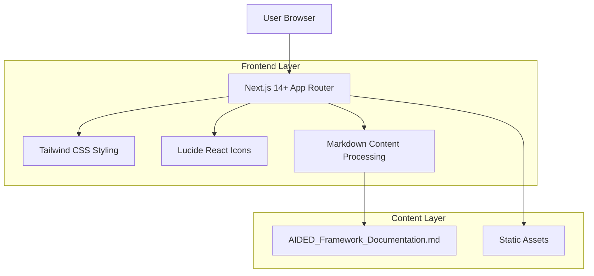

# Documento de Arquitectura Técnica - Sitio de Documentación AIDED Framework

## 1. Arquitectura design



## 2. Tecnología Description

- Frontend: Next.js 14+ (App Router) + React@18 + Tailwind CSS@3
- Initialization Tool: create-next-app@latest
- Iconos: Lucide React
- Procesamiento de Contenido: next-mdx-remote / remark / rehype
- Backend: None (Static Site Generation)
- Despliegue: Vercel (recomendado) o Static Hosting

## 3. Route definitions

| Route | Purpose |
|-------|---------|
| / | Dashboard principal con tarjetas de navegación |
| /docs/[...slug] | Páginas de documentación dinámicas |
| /themes | Sección de temas (marcado como "Hot") |
| /github | Redirección a repositorio GitHub |
| /getting-started | Guía de inicio |
| /installation | Instrucciones de instalación |
| /components | Documentación de componentes |
| /api-reference | Referencia de API |
| /guides | Guías detalladas |
| /webhooks | Documentación de webhooks |
| /integrations | Integraciones de terceros |
| /rate-limits | Límites de uso |
| /security | Mejores prácticas de seguridad |
| /changelog | Historial de cambios |
| /faq | Preguntas frecuentes |
| /support | Ayuda y soporte |

## 4. Estructura de Componentes

### 4.1 Layout Components
```typescript
// app/layout.tsx
interface RootLayout {
  children: React.ReactNode
}

// components/Sidebar.tsx
interface SidebarProps {
  className?: string
}

// components/Navigation.tsx
interface NavigationItem {
  title: string
  href: string
  icon: LucideIcon
  badge?: "hot" | "new" | "beta"
  children?: NavigationItem[]
}
```

### 4.2 Content Components
```typescript
// components/DocCard.tsx
interface DocCardProps {
  title: string
  description: string
  icon: LucideIcon
  href: string
}

// components/Breadcrumb.tsx
interface BreadcrumbItem {
  label: string
  href?: string
}

interface BreadcrumbProps {
  items: BreadcrumbItem[]
}
```

## 5. Procesamiento de Contenido

### 5.1 MDX Configuration
- **Plugin**: @next/mdx
- **Remark Plugins**: remark-gfm (GitHub Flavored Markdown)
- **Rehype Plugins**: rehype-highlight (syntax highlighting)
- **Custom Components**: Componentes React embebidos en MDX

### 5.2 Estructura de Contenido
```
content/
├── index.mdx          // Dashboard principal
├── getting-started/
│   ├── index.mdx
│   └── quick-start.mdx
├── installation/
│   ├── index.mdx
│   └── requirements.mdx
├── components/
│   ├── index.mdx
│   └── [component].mdx
└── api-reference/
    ├── index.mdx
    └── [endpoint].mdx
```

## 6. Estilos y Diseño

### 6.1 Sistema de Diseño
- **Colores Primarios**: gray-900 (texto), gray-100 (fondo sidebar)
- **Colores Secundarios**: orange-500 (badge "Hot"), blue-600 (links)
- **Tipografía**: system-ui, sans-serif
- **Bordes**: rounded-lg (8px), border-gray-200
- **Sombras**: shadow-sm, shadow-md

### 6.2 Responsive Design
- **Desktop**: Sidebar fijo 280px, contenido fluido
- **Tablet**: Sidebar colapsable, overlay en móvil
- **Mobile**: Menú hamburguesa, contenido full-width

## 7. Optimizaciones

### 7.1 Performance
- **Static Generation**: next build genera páginas estáticas
- **Image Optimization**: next/image para imágenes
- **Font Optimization**: next/font para fuentes personalizadas

### 7.2 SEO
- **Metadata Dinámica**: generateMetadata para cada página
- **Sitemap**: generación automática
- **Structured Data**: JSON-LD para documentación

## 8. Deployment

### 8.1 Vercel (Recomendado)
```bash
# Build Settings
Framework Preset: Next.js
Build Command: next build
Output Directory: .next
```

### 8.2 Static Export (Alternativa)
```bash
# next.config.js
output: 'export'
distDir: 'out'
```

## 9. Estructura del Proyecto

```
aided-docs/
├── app/
│   ├── layout.tsx          # Root layout con sidebar
│   ├── page.tsx            # Dashboard principal
│   └── docs/
│       └── [...slug]/
│           └── page.tsx     # Páginas dinámicas
├── components/
│   ├── Sidebar.tsx         # Navegación lateral
│   ├── DocCard.tsx         # Tarjetas de documentación
│   ├── Breadcrumb.tsx      # Migas de pan
│   └── ui/                 # Componentes UI base
├── content/                # Archivos MDX
├── lib/
│   ├── content.ts          # Utils para contenido
│   └── navigation.ts       # Config de navegación
├── public/                 # Assets estáticos
└── styles/
    └── globals.css         # Estilos globales
```