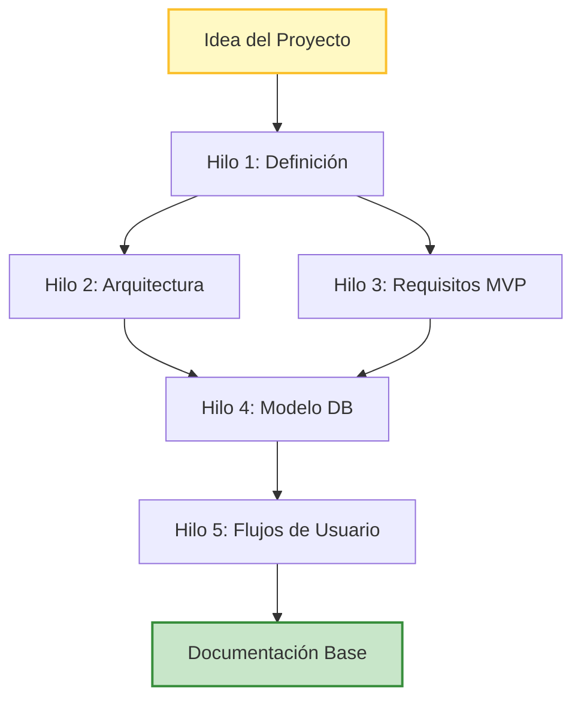
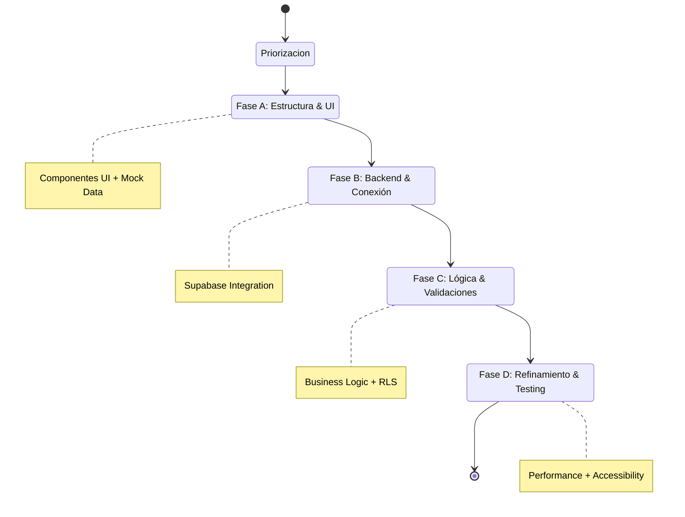

# Framework AIDED
**Metodología de Desarrollo Asistido por IA**

> **v1.0** | Documentación Oficial
>
> Este sitio está diseñado para ayudarte a obtener el máximo provecho de la metodología AIDED. Aquí encontrarás una colección de guías, procesos y tutoriales que cubren todos los aspectos del desarrollo asistido por Inteligencia Artificial.

---

## 📍 Puntos de Partida

*Todo lo que necesitas para empezar a utilizar el framework de forma rápida y eficiente.*

| Sección | Descripción | Icono |
| :--- | :--- | :---: |
| **[Principios Fundamentales](#principios-fundamentales)** | Los pilares de la colaboración Humano-IA. | ⚖️ |
| **[Fase 0: Conceptualización](#fase-0-conceptualización-y-arquitectura-asistida)** | Arquitectura y definición del producto. | 🚀 |
| **[Fase 1: Gestión](#fase-1-preparación-del-proyecto-en-sistema-de-gestión)** | Centralización de documentación (ClickUp). | 📋 |
| **[Fase 2: Backend](#fase-2-configuración-de-backend-y-base-de-datos)** | Infraestructura de datos con Supabase. | 🗄️ |
| **[Fase 3: Frontend](#fase-3-inicialización-del-proyecto-frontend)** | Inicialización de Next.js y estructura. | ⚛️ |
| **[Fase 4: Diseño UX/UI](#fase-4-diseño-uxui-con-ia)** | Flujos de diseño asistido por IA. | 🎨 |
| **[Fase 5: Desarrollo](#fase-5-desarrollo-evolutivo-con-agentes-de-ia)** | Implementación con Agentes especializados. | 🤖 |
| **[Fase 6: Testing & CI/CD](#fase-6-testing-cicd-y-despliegue)** | Automatización y garantía de calidad. | ✅ |

---

## Menú de Contenidos

1. [Introducción](#introducción)
2. [Principios Fundamentales](#principios-fundamentales)
3. [Fases del Framework](#fases-del-framework-aided)
4. [Guía para Agentes de IA](#11-guía-para-agentes-de-ia)
5. [Recursos y Enlaces](#12-recursos-y-enlaces)
6. [Apéndices](#apéndices)

---

## Introducción

**AIDED** (AI-Driven Engineering Development) es una metodología integral de desarrollo de software que aprovecha las capacidades de la inteligencia artificial en cada fase del ciclo de vida del proyecto. Este framework proporciona un enfoque estructurado y escalable para la construcción de aplicaciones modernas, optimizando la colaboración entre desarrolladores e IA.

A diferencia de metodologías tradicionales como Agile o Scrum, AIDED está diseñado específicamente para maximizar la eficiencia y calidad del desarrollo asistido por IA, estableciendo procesos claros de documentación, arquitectura y despliegue continuos.

---

## Principios Fundamentales

1.  **Contexto sobre Código**: La calidad del desarrollo depende directamente de la calidad del contexto proporcionado a la IA.
2.  **Documentación Viva**: La documentación evoluciona junto con el proyecto y sirve como fuente de verdad.
3.  **Iteración Incremental**: Desarrollo progresivo basado en flujos de usuario completos.
4.  **Trazabilidad Total**: Cada decisión arquitectónica y funcional debe estar documentada y accesible.
5.  **Separación de Responsabilidades**: Agentes de IA especializados para diferentes aspectos del desarrollo.

---

## Fases del Framework AIDED

```mermaid
graph TD
    A[Inicio] --> P0[Fase 0: Conceptualización]
    P0 --> P1[Fase 1: Gestión (ClickUp)]
    P1 --> P2[Fase 2: Backend (Supabase)]
    P1 --> P3[Fase 3: Frontend (Next.js)]
    P2 --> P4[Fase 4: Diseño UX/UI]
    P3 --> P4
    P4 --> P5[Fase 5: Desarrollo con Agentes]
    P5 --> P6[Fase 6: Testing & CI/CD]
    P6 --> Fin[Producto Desplegado]
    
    style P0 fill:#e1f5fe,stroke:#01579b,stroke-width:2px
    style P1 fill:#e1f5fe,stroke:#01579b,stroke-width:2px
    style P2 fill:#fff3e0,stroke:#e65100,stroke-width:2px
    style P3 fill:#fff3e0,stroke:#e65100,stroke-width:2px
    style P4 fill:#f3e5f5,stroke:#4a148c,stroke-width:2px
    style P5 fill:#e8f5e9,stroke:#1b5e20,stroke-width:2px
    style P6 fill:#ffebee,stroke:#b71c1c,stroke-width:2px
```

### FASE 0: Conceptualización y Arquitectura Asistida

> **Objetivo**: Establecer una base sólida de conocimiento sobre el proyecto mediante iteraciones estructuradas con IA.

#### Proceso de Conceptualización



**Hilo 1: Definición del Proyecto**
*   Describe tu idea de producto o aplicación a la IA de forma detallada.
*   Incluye: problema a resolver, usuarios objetivo, propuesta de valor, diferenciadores.
*   Concluye el prompt con: *"Dame un paso a paso detallado para que el proyecto sea exitoso y escale"*.
*   **Entregable**: Roadmap inicial del proyecto con hitos y recomendaciones.

**Hilo 2: Arquitectura de Infraestructura**
*   Solicita un diagrama de arquitectura en formato Mermaid.
*   Especifica: *"En base al contexto del proyecto, crea un diagrama de infraestructura técnica que muestre componentes, servicios, bases de datos y flujos de comunicación"*.
*   **Entregable**: Código Mermaid con diagrama de arquitectura completo.

**Hilo 3: Requisitos Funcionales del MVP**
*   Pide una tabla estructurada de requisitos funcionales priorizados.
*   Formato sugerido: *"Genera una tabla de requisitos funcionales para el MVP con columnas: ID, Funcionalidad, Descripción, Prioridad, Complejidad"*.
*   **Entregable**: Tabla de requisitos exportable (Markdown/CSV).

**Hilo 4: Modelado de Base de Datos**
*   Solicita el diseño del esquema de base de datos.
*   Incluye: *"Genera el modelo de datos en formato Mermaid o PlantUML, incluyendo todas las tablas, relaciones, tipos de datos y constraints"*.
*   Solicita adicionalmente:
    *   Políticas de RLS (Row Level Security) por tabla.
    *   Triggers necesarios para integridad de datos.
    *   Functions de base de datos para lógica recurrente.
    *   Índices recomendados para optimización.
*   **Entregable**: Diagrama ER, scripts SQL, documentación de seguridad.

**Hilo 5: Capa de Negocio y Flujos de Usuario**
*   Define la lógica de negocio por roles de usuario.
*   Solicita: *"Describe paso a paso cómo funcionará la aplicación. Explica el recorrido completo para cada tipo de usuario (rol) desde el registro hasta las funciones principales"*.
*   **Entregable**: Diagramas de flujo de usuario, casos de uso detallados.

#### Resultado de la Fase 0
Al finalizar esta fase, dispondrás de:
*   Visión clara y estructurada del proyecto.
*   Arquitectura técnica validada.
*   Requisitos funcionales priorizados.
*   Diseño completo de base de datos.
*   Flujos de negocio documentados.
*   Chat con contexto rico para iteraciones futuras.

---

### FASE 1: Preparación del Proyecto en Sistema de Gestión

> **Objetivo**: Centralizar toda la documentación en un sistema de gestión de proyectos que sirva como fuente única de verdad.

#### Configuración en ClickUp (o similar)

**Estructura de Espacios Recomendada:**

```text
📁 [Nombre del Proyecto]
  ├── 📋 Infraestructura
  ├── 📋 Requisitos Funcionales
  ├── 📋 Diseño de Base de Datos
  ├── 📋 API Design
  ├── 📋 UX/UI
  └── 📋 Prompts y Recursos de Desarrollo
```

#### Contenido de Cada Sección

**1. Infraestructura**
*   Diagrama Mermaid generado en Fase 0.
*   Descripción textual de cada componente.
*   Decisiones de arquitectura y justificaciones.
*   Dependencias de servicios externos.
*   Estimaciones de costos de infraestructura.
*   Consideraciones de escalabilidad.

**2. Requisitos Funcionales**
*   Tabla completa de requisitos del MVP.
*   Matriz de priorización (MoSCoW: Must, Should, Could, Won't).
*   Criterios de aceptación por funcionalidad.
*   Estimaciones de esfuerzo.
*   Dependencias entre requisitos.

**3. Diseño de Base de Datos**
*   Diagrama ER visual (imagen).
*   Scripts SQL completos para creación de tablas.
*   Documentación de cada tabla y campo.
*   Subpáginas organizadas:
    *   **Schema**: Estructura de tablas.
    *   **Functions & Triggers**: Lógica de base de datos.
    *   **RLS Policies**: Políticas de seguridad por tabla.
    *   **Índices y Optimización**: Estrategias de rendimiento.
    *   **Migraciones**: Versionado de cambios de esquema.

**4. API Design**
*   Especificación de endpoints (estilo OpenAPI).
*   Versionado de API (v1, v2, etc.).
*   Autenticación y autorización.
*   Schemas de request/response.
*   Códigos de error y manejo.
*   Rate limiting y throttling.
*   Documentación de integración.

**5. UX/UI**
*   Enlaces a diseños en Figma.
*   Guía de estilos (colores, tipografías, espaciados).
*   Biblioteca de componentes.
*   Flujos de navegación.
*   Especificaciones responsive.
*   Consideraciones de accesibilidad.

**6. Prompts y Recursos de Desarrollo**
*   Biblioteca de prompts exitosos por tipo de tarea.
*   Configuración de agentes de IA.
*   Snippets de código reutilizables.
*   Soluciones a problemas comunes.
*   Checklist de desarrollo por feature.

#### Mantenimiento Continuo
*   **Actualización obligatoria**: Cada cambio significativo debe reflejarse en ClickUp.
*   **Versionado**: Mantener histórico de decisiones importantes.
*   **Review semanal**: Validar que la documentación esté sincronizada con el código.

---

### FASE 2: Configuración de Backend y Base de Datos

> **Objetivo**: Implementar la infraestructura de datos siguiendo el diseño documentado.

#### Configuración de Supabase

**Paso 1: Inicialización del Proyecto**
1.  Crear cuenta en [Supabase](https://supabase.com).
2.  Crear nuevo proyecto con:
    *   Nombre descriptivo del proyecto.
    *   Región cercana a tus usuarios objetivo.
    *   Password de base de datos fuerte (almacenar en gestor de contraseñas).
    *   Plan apropiado (Free tier para desarrollo inicial).

**Paso 2: Implementación del Schema**
1.  Abrir SQL Editor en Supabase.
2.  Ejecutar scripts en orden:

```sql
-- 1. Extensiones necesarias
CREATE EXTENSION IF NOT EXISTS "uuid-ossp";

-- 2. Tablas principales (orden según dependencias)
-- 3. Índices
-- 4. Triggers
-- 5. Functions
-- 6. RLS Policies
```

3.  Validar cada script antes de continuar.
4.  Documentar cualquier modificación respecto al diseño original.

**Paso 3: Configuración de Seguridad**
*   Habilitar Row Level Security en todas las tablas.
*   Implementar políticas RLS documentadas en ClickUp.
*   Configurar roles y permisos.
*   Establecer políticas de backup automático.

**Paso 4: Configuración de Autenticación**
*   Configurar providers de autenticación (Email, Google, GitHub, etc.).
*   Personalizar emails de autenticación.
*   Configurar URLs de redirección.
*   Establecer políticas de contraseñas.

**Paso 5: Validación**
*   Probar conexiones desde SQL Editor.
*   Verificar que RLS funciona correctamente.
*   Insertar datos de prueba para validar relaciones.
*   Documentar credenciales y configuración en gestor seguro.

#### Gestión de Migraciones
*   Guardar todos los scripts SQL en repositorio Git.
*   Usar herramienta de migraciones (Supabase CLI o custom).
*   Mantener versionado de cambios de schema.
*   Documentar cada migración con propósito y fecha.

---

### FASE 3: Inicialización del Proyecto Frontend

> **Objetivo**: Configurar el proyecto frontend con las mejores prácticas y conectarlo a los servicios backend.

#### Configuración del Proyecto Next.js

**Paso 1: Creación del Proyecto**

```bash
# Usar template oficial de Supabase
npx create-next-app -e with-supabase nombre-proyecto

# O instalación manual
npx create-next-app@latest nombre-proyecto
cd nombre-proyecto
npm install @supabase/supabase-js @supabase/auth-helpers-nextjs
```

**Paso 2: Estructura de Carpetas Recomendada**

```text
src/
├── app/                    # App Router de Next.js
│   ├── (auth)/            # Rutas de autenticación
│   ├── (dashboard)/       # Rutas protegidas
│   └── api/               # API Routes
├── components/
│   ├── ui/                # Componentes base (buttons, inputs, etc.)
│   ├── features/          # Componentes por funcionalidad
│   └── layouts/           # Layouts reutilizables
├── lib/
│   ├── supabase/          # Cliente y utilidades de Supabase
│   ├── utils/             # Funciones auxiliares
│   └── hooks/             # Custom React hooks
├── types/
│   └── supabase.ts        # Tipos generados desde DB
└── styles/
    └── globals.css        # Estilos globales
```

**Paso 3: Configuración de Variables de Entorno**

```bash
# .env.local
NEXT_PUBLIC_SUPABASE_URL=tu_supabase_url
NEXT_PUBLIC_SUPABASE_ANON_KEY=tu_anon_key
SUPABASE_SERVICE_ROLE_KEY=tu_service_role_key

# Otras variables
NEXT_PUBLIC_APP_URL=http://localhost:3000
NODE_ENV=development
```

**Paso 4: Configuración del Cliente Supabase**

```typescript
// lib/supabase/client.ts
import { createClientComponentClient } from '@supabase/auth-helpers-nextjs'
import { Database } from '@/types/supabase'

export const createClient = () => createClientComponentClient<Database>()
```

**Paso 5: Generación de Tipos TypeScript**

```bash
# Generar tipos desde tu schema de Supabase
npx supabase gen types typescript --project-id "tu-project-id" > types/supabase.ts
```

#### Control de Versiones

**Inicialización de Git**

```bash
git init
git add .
git commit -m "Initial commit: Next.js + Supabase setup"
```

**Configuración de .gitignore**
Asegúrate de ignorar `node_modules/`, `.env*.local`, `.next/`, etc.

**Conexión con GitHub**

```bash
gh repo create nombre-proyecto --private --source=. --remote=origin
git branch -M main
git push -u origin main
```

#### Despliegue Inicial (Opcional)

**Vercel**
1.  Conectar repositorio de GitHub a Vercel.
2.  Configurar variables de entorno en dashboard de Vercel.
3.  Establecer configuraciones de build (Preset Next.js).
4.  Desplegar rama `main` para producción.

#### Validación de Configuración
- [ ] El proyecto arranca correctamente (`npm run dev`).
- [ ] La conexión a Supabase funciona.
- [ ] Las variables de entorno están configuradas.
- [ ] Los tipos TypeScript están generados.
- [ ] El repositorio Git está configurado.

---

### FASE 4: Diseño UX/UI con IA

> **Objetivo**: Crear diseños visuales profesionales y funcionales utilizando herramientas de IA y flujos optimizados.

#### Proceso de Diseño Asistido

```mermaid
graph LR
    Step1[1. Investigación] --> Step2[2. Prompt Design]
    Step2 --> Step3[3. Generación IA (v0/Stitch)]
    Step3 --> Step4[4. Figma (HTML to Design)]
    Step4 --> Step5[5. Documentación]
    Step5 --> Step6[6. Dev Ready]
    
    style Step3 fill:#e1bee7,stroke:#8e24aa,stroke-width:2px
    style Step6 fill:#b2dfdb,stroke:#00796b,stroke-width:2px
```

**Paso 1: Investigación y Referencias**
1.  **Búsqueda de Inspiración**: Dribbble, Behance, Mobbin.
2.  **Creación de Mood Board**: Compilar referencias visuales, esquemas de color y patrones.

**Paso 2: Generación de Prompt de Diseño**
Solicita a ChatGPT un prompt detallado incluyendo estilo visual, paleta, tipografía y componentes, basado en el contexto de la Fase 0.

**Paso 3: Generación de Diseño con v0/Stitch**
1.  Crear proyecto en v0.dev o Stitch.
2.  Usar el prompt generado e iterar (Generación → Revisión → Ajustes).
3.  Generar variantes y diseño responsive (Mobile, Tablet, Desktop).

**Paso 4: Exportación y Conversión a Figma**
1.  Exportar código HTML/CSS.
2.  Usar plugin "HTML to Design" en Figma.
3.  Organizar en Figma (Design System, Screens, Flows).
4.  Crear Design System (Componentes, Variantes, Auto-layout).

**Paso 5: Documentación de Diseño**
En ClickUp: Link al Figma, Guía de estilos, Specs de componentes y flujos.

**Paso 6: Preparación para Desarrollo**
1.  Activar **Dev Mode** en Figma.
2.  Exportar assets (SVG, WebP).
3.  Documentar especificaciones responsive y estados interactivos.

#### Herramientas Alternativas
*   **v0.dev**: Componentes React/Next.js.
*   **Stitch by OpenAI**: Layouts completos.
*   **Uizard**: Sketches a diseño.
*   **Figma AI**: Herramientas nativas.

---

### FASE 5: Desarrollo Evolutivo con Agentes de IA

> **Objetivo**: Implementar el proyecto de forma incremental utilizando agentes de IA especializados con contexto completo.

#### Configuración de Agentes en Editor de IA

**Paso 1: Configuración del Entorno**
Abrir proyecto en editor (Trae, Cursor, etc.) y verificar conexiones.

**Paso 2: Creación de Agente Maquetador**
Configurar un "Frontend Architect & UI Developer" con un System Prompt especializado en conversión de diseño a código, Tailwind CSS, y arquitectura de componentes.

**Paso 3: Creación del Archivo AGENTS.md**
Este archivo proporciona contexto global en la raíz del proyecto.

**Estructura de AGENTS.md:**
1.  **Información General**: Stack, Arquitectura, Propósito.
2.  **Estructura de Base de Datos**: Schema, Tablas principales.
3.  **Políticas de Seguridad (RLS)**.
4.  **Functions y Triggers**.
5.  **Flujos de Usuario**.
6.  **Arquitectura de Componentes**: Carpetas, Naming conventions.
7.  **Patrones de Código**: Server vs Client Components, Data Fetching.
8.  **Configuración de Servicios**.
9.  **Reglas de Desarrollo**: TypeScript, Estilos, Performance, Accesibilidad.
10. **Testing**.
11. **Guía para Agentes de IA**.
12. **Recursos y Enlaces**.

#### Estrategia de Desarrollo Incremental



**1. Priorización de Flujos**
1.  Autenticación.
2.  Onboarding.
3.  Dashboard/Home.
4.  Feature principal.
5.  Configuración.

**2. Desarrollo por Fases**
*   **Fase A (Estructura)**: Componentes UI con datos mock. Validación visual.
*   **Fase B (Backend)**: Servicios Supabase y conexión real.
*   **Fase C (Lógica)**: Validaciones, edge cases, optimistic updates.
*   **Fase D (Refinamiento)**: Performance, accesibilidad, testing.

#### Ejemplo Práctico: Flujo de Registro
1.  **Iteración 1 (Maquetación)**: Crear `RegisterForm` con diseño de Figma y datos mock.
2.  **Iteración 2 (Servicios)**: Crear servicio `auth.ts` con funciones `signUp`, `signIn`.
3.  **Iteración 3 (Integración)**: Conectar formulario con servicio, manejo de errores y loading.

#### Configuración de Servicios Externos
Usar **Edge Functions** de Supabase para lógica sensible, webhooks o tareas programadas.

#### Buenas Prácticas de Desarrollo
*   **Commits Atómicos**: `feat:`, `fix:`, `style:`.
*   **Branches Strategy**: `main`, `dev`, `feature/*`.
*   **Code Review con IA**: Pedir revisión de seguridad, performance y tipos antes del commit.
*   **Documentación Continua**: Actualizar `AGENTS.md` y `CHANGELOG.md`.

---

### FASE 6: Testing, CI/CD y Despliegue

> **Objetivo**: Establecer pipeline de despliegue automatizado con calidad garantizada.

#### Configuración de Testing
1.  **Unit Testing con Jest**: Componentes críticos y utilidades.
2.  **Integration Testing**: Flujos de autenticación y formularios.
3.  **E2E Testing con Playwright (Opcional)**: Flujos completos de usuario.

#### Configuración de CI/CD
1.  **GitHub Actions**: Pipeline de `CI` (test, lint, build) y `Deploy to Staging`.
2.  **Husky**: Git hooks para pre-commit (lint-staged).
3.  **Scripts**: `npm run test:ci`, `npm run format`.

#### Estrategia de Despliegue
**Vercel (Recomendado)**
*   **Production**: Rama `main` -> `app.tudominio.com`.
*   **Preview**: Rama `dev` -> `staging.tudominio.com`.

**Alternativa: VPS con Docker**
Uso de `Dockerfile` y `docker-compose.yml` para despliegue autocontenido.

#### Monitoreo y Logging
*   **Sentry**: Error tracking.
*   **Vercel Analytics**: Métricas de usuario.
*   **Supabase Logs**: Base de datos y Auth.

#### Checklist de Despliegue
- [ ] Tests pasan localmente.
- [ ] Build exitoso.
- [ ] Variables de entorno en producción.
- [ ] Migraciones aplicadas.
- [ ] Smoke tests en producción.

---

## 11. Guía para Agentes de IA

### Cuando desarrolles nuevas features:
1.  **Consulta AGENTS.md** para entender el contexto.
2.  **Revisa el schema de BD** antes de escribir queries.
3.  **Sigue los patrones establecidos** (Server Components, etc.).
4.  **Respeta las convenciones** de naming y estructura.
5.  **Valida RLS** para operaciones de base de datos.
6.  **Incluye manejo de errores** y loading states.
7.  **Piensa en mobile-first**.

### Checklist antes de completar una tarea:
- [ ] Código sigue convenciones.
- [ ] Tipos TypeScript correctos.
- [ ] RLS considerado.
- [ ] Responsive design implementado.
- [ ] Accesibilidad validada.
- [ ] Sin console.logs.

---

## 12. Recursos y Enlaces

*   **Documentación**: [Next.js](https://nextjs.org/docs), [Supabase](https://supabase.com/docs), [Tailwind CSS](https://tailwindcss.com/docs).
*   **Herramientas**: ChatGPT/Claude, Trae/Cursor, ClickUp, Figma, v0.dev.

---

## Apéndices

### A. Plantillas de Prompts
Incluye plantillas para "Feature Nueva" y "Debugging".

### B. Checklist de Feature Completa
Lista de verificación desde UI hasta Documentation.

---

## Conclusión

El framework **AIDED** proporciona una metodología estructurada para el desarrollo de software moderno aprovechando las capacidades de la inteligencia artificial.

*   **Reduces tiempo de desarrollo.**
*   **Aumentas calidad.**
*   **Escalas eficientemente.**
*   **Mantienes control.**

> **La clave del éxito es la consistencia en la aplicación de cada fase y la actualización continua de la documentación.**

---
*Documentación generada para Framework AIDED.*
