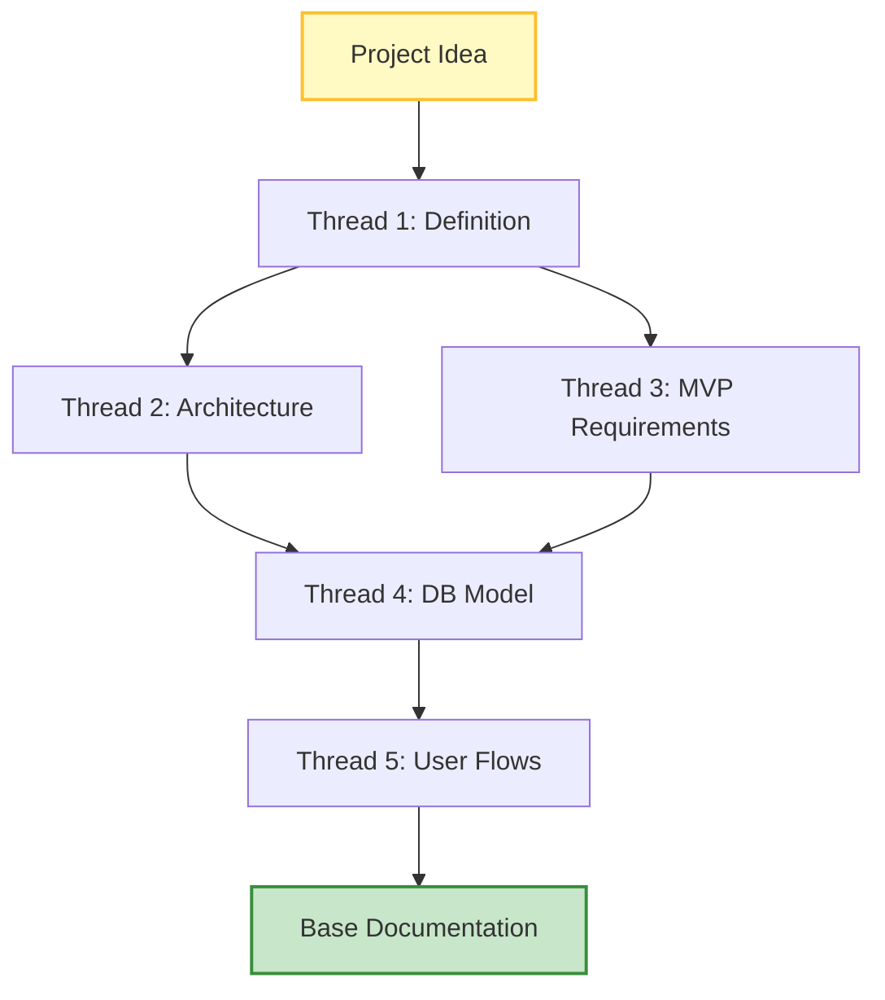
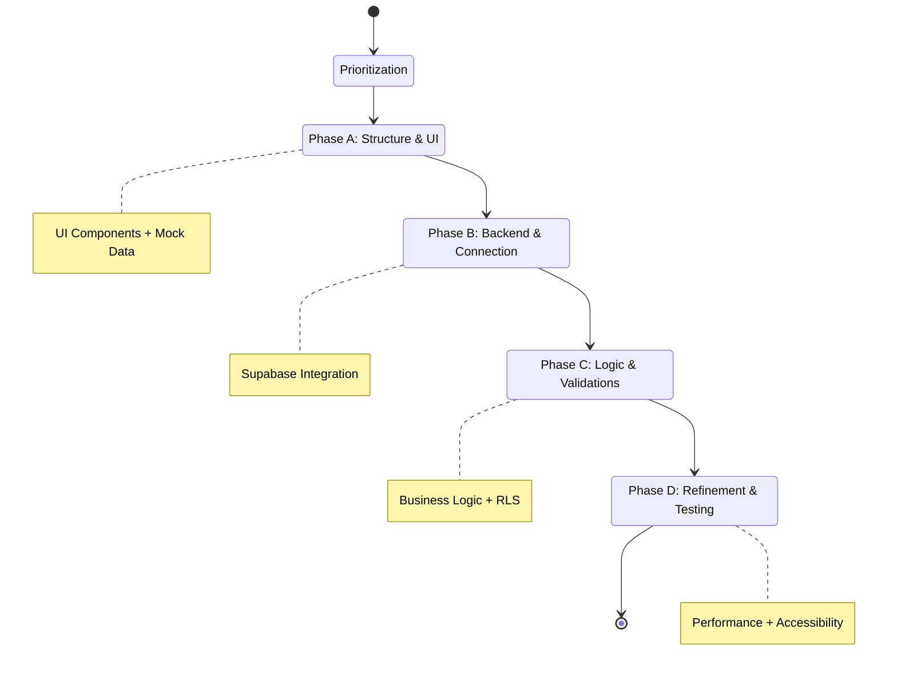

# AIDED Framework
**AI-Driven Development Methodology**

> **v1.0** | Official Documentation
>
> This site is designed to help you get the most out of the AIDED methodology. Here you will find a collection of guides, processes, and tutorials covering all aspects of Artificial Intelligence-assisted development.

---

## 📍 Starting Points

*Everything you need to start using the framework quickly and efficiently.*

| Section | Description | Icon |
| :--- | :--- | :---: |
| **[Fundamental Principles](#fundamental-principles)** | The pillars of Human-AI collaboration. | ⚖️ |
| **[Phase 0: Conceptualization](#phase-0-conceptualization-and-assisted-architecture)** | Architecture and product definition. | 🚀 |
| **[Phase 1: Management](#phase-1-project-preparation-in-management-system)** | Documentation centralization (ClickUp). | 📋 |
| **[Phase 2: Backend](#phase-2-backend-and-database-configuration)** | Data infrastructure with Supabase. | 🗄️ |
| **[Phase 3: Frontend](#phase-3-frontend-project-initialization)** | Next.js initialization and structure. | ⚛️ |
| **[Phase 4: UX/UI Design](#phase-4-uxui-design-with-ai)** | AI-assisted design flows. | 🎨 |
| **[Phase 5: Development](#phase-5-evolutionary-development-with-ai-agents)** | Implementation with specialized Agents. | 🤖 |
| **[Phase 6: Testing & CI/CD](#phase-6-testing-cicd-and-deployment)** | Automation and quality assurance. | ✅ |

---

## Content Menu

1. [Introduction](#introduction)
2. [Fundamental Principles](#fundamental-principles)
3. [Framework Phases](#aided-framework-phases)
4. [Guide for AI Agents](#11-guide-for-ai-agents)
5. [Resources and Links](#12-resources-and-links)
6. [Appendices](#appendices)

---

## Introduction

**AIDED** (AI-Driven Engineering Development) is a comprehensive software development methodology that leverages artificial intelligence capabilities in every phase of the project lifecycle. This framework provides a structured and scalable approach for building modern applications, optimizing collaboration between developers and AI.

Unlike traditional methodologies like Agile or Scrum, AIDED is specifically designed to maximize the efficiency and quality of AI-assisted development, establishing clear processes for documentation, architecture, and continuous deployment.

---

## Fundamental Principles

1.  **Context over Code**: Development quality directly depends on the quality of the context provided to the AI.
2.  **Living Documentation**: Documentation evolves along with the project and serves as the source of truth.
3.  **Incremental Iteration**: Progressive development based on complete user flows.
4.  **Total Traceability**: Every architectural and functional decision must be documented and accessible.
5.  **Separation of Responsibilities**: Specialized AI agents for different aspects of development.

---

## AIDED Framework Phases

```mermaid
graph TD
    A[Start] --> P0[Phase 0: Conceptualization]
    P0 --> P1[Phase 1: Management (ClickUp)]
    P1 --> P2[Phase 2: Backend (Supabase)]
    P1 --> P3[Phase 3: Frontend (Next.js)]
    P2 --> P4[Phase 4: UX/UI Design]
    P3 --> P4
    P4 --> P5[Phase 5: Development with Agents]
    P5 --> P6[Phase 6: Testing & CI/CD]
    P6 --> Fin[Deployed Product]
    
    style P0 fill:#e1f5fe,stroke:#01579b,stroke-width:2px
    style P1 fill:#e1f5fe,stroke:#01579b,stroke-width:2px
    style P2 fill:#fff3e0,stroke:#e65100,stroke-width:2px
    style P3 fill:#fff3e0,stroke:#e65100,stroke-width:2px
    style P4 fill:#f3e5f5,stroke:#4a148c,stroke-width:2px
    style P5 fill:#e8f5e9,stroke:#1b5e20,stroke-width:2px
    style P6 fill:#ffebee,stroke:#b71c1c,stroke-width:2px
```

### PHASE 0: Conceptualization and Assisted Architecture

> **Objective**: Establish a solid knowledge base for the project through structured iterations with AI.

#### Conceptualization Process



**Thread 1: Project Definition**
*   Describe your product or application idea to the AI in detail.
*   Include: problem to solve, target users, value proposition, differentiators.
*   Conclude the prompt with: *"Give me a detailed step-by-step plan for the project to be successful and scalable"*.
*   **Deliverable**: Initial project roadmap with milestones and recommendations.

**Thread 2: Infrastructure Architecture**
*   Request an architecture diagram in Mermaid format.
*   Specify: *"Based on the project context, create a technical infrastructure diagram showing components, services, databases, and communication flows"*.
*   **Deliverable**: Mermaid code with complete architecture diagram.

**Thread 3: MVP Functional Requirements**
*   Ask for a structured table of prioritized functional requirements.
*   Suggested format: *"Generate a table of functional requirements for the MVP with columns: ID, Functionality, Description, Priority, Complexity"*.
*   **Deliverable**: Exportable requirements table (Markdown/CSV).

**Thread 4: Database Modeling**
*   Request the database schema design.
*   Include: *"Generate the data model in Mermaid or PlantUML, including all tables, relationships, data types, and constraints"*.
*   Request additionally:
    *   RLS (Row Level Security) policies per table.
    *   Triggers necessary for data integrity.
    *   Database functions for recurring logic.
    *   Recommended indexes for optimization.
*   **Deliverable**: ER diagram, SQL scripts, security documentation.

**Thread 5: Business Layer and User Flows**
*   Define business logic by user roles.
*   Request: *"Describe step-by-step how the application will work. Explain the complete journey for each user type (role) from registration to main functions"*.
*   **Deliverable**: User flow diagrams, detailed use cases.

#### Phase 0 Outcome
By the end of this phase, you will have:
*   Clear and structured vision of the project.
*   Validated technical architecture.
*   Prioritized functional requirements.
*   Complete database design.
*   Documented business flows.
*   Rich context chat for future iterations.

---

### PHASE 1: Project Preparation in Management System

> **Objective**: Centralize all documentation in a project management system serving as the single source of truth.

#### Configuration in ClickUp (or similar)

**Recommended Space Structure:**

```text
📁 [Project Name]
  ├── 📋 Infrastructure
  ├── 📋 Functional Requirements
  ├── 📋 Database Design
  ├── 📋 API Design
  ├── 📋 UX/UI
  └── 📋 Prompts and Development Resources
```

#### Content of Each Section

**1. Infrastructure**
*   Mermaid diagram generated in Phase 0.
*   Textual description of each component.
*   Architecture decisions and justifications.
*   External service dependencies.
*   Infrastructure cost estimates.
*   Scalability considerations.

**2. Functional Requirements**
*   Complete table of MVP requirements.
*   Prioritization matrix (MoSCoW: Must, Should, Could, Won't).
*   Acceptance criteria per functionality.
*   Effort estimates.
*   Dependencies between requirements.

**3. Database Design**
*   Visual ER diagram (image).
*   Complete SQL scripts for table creation.
*   Documentation of each table and field.
*   Organized subpages:
    *   **Schema**: Table structure.
    *   **Functions & Triggers**: Database logic.
    *   **RLS Policies**: Security policies per table.
    *   **Indexes and Optimization**: Performance strategies.
    *   **Migrations**: Schema change versioning.

**4. API Design**
*   Endpoint specification (OpenAPI style).
*   API Versioning (v1, v2, etc.).
*   Authentication and authorization.
*   Request/response schemas.
*   Error codes and handling.
*   Rate limiting and throttling.
*   Integration documentation.

**5. UX/UI**
*   Links to Figma designs.
*   Style guide (colors, typography, spacing).
*   Component library.
*   Navigation flows.
*   Responsive specifications.
*   Accessibility considerations.

**6. Prompts and Development Resources**
*   Library of successful prompts by task type.
*   AI agent configuration.
*   Reusable code snippets.
*   Solutions to common problems.
*   Development checklist per feature.

#### Continuous Maintenance
*   **Mandatory Update**: Every significant change must be reflected in ClickUp.
*   **Versioning**: Maintain history of important decisions.
*   **Weekly Review**: Validate that documentation is synchronized with code.

---

### PHASE 2: Backend and Database Configuration

> **Objective**: Implement data infrastructure following the documented design.

#### Supabase Configuration

**Step 1: Project Initialization**
1.  Create account at [Supabase](https://supabase.com).
2.  Create new project with:
    *   Descriptive project name.
    *   Region close to your target users.
    *   Strong database password (store in password manager).
    *   Appropriate plan (Free tier for initial development).

**Step 2: Schema Implementation**
1.  Open SQL Editor in Supabase.
2.  Execute scripts in order:

```sql
-- 1. Necessary extensions
CREATE EXTENSION IF NOT EXISTS "uuid-ossp";

-- 2. Main tables (order by dependencies)
-- 3. Indexes
-- 4. Triggers
-- 5. Functions
-- 6. RLS Policies
```

3.  Validate each script before continuing.
4.  Document any modification regarding the original design.

**Step 3: Security Configuration**
*   Enable Row Level Security on all tables.
*   Implement RLS policies documented in ClickUp.
*   Configure roles and permissions.
*   Establish automatic backup policies.

**Step 4: Authentication Configuration**
*   Configure authentication providers (Email, Google, GitHub, etc.).
*   Customize authentication emails.
*   Configure redirect URLs.
*   Establish password policies.

**Step 5: Validation**
*   Test connections from SQL Editor.
*   Verify RLS works correctly.
*   Insert test data to validate relationships.
*   Document credentials and configuration in secure manager.

#### Migration Management
*   Save all SQL scripts in Git repository.
*   Use migration tool (Supabase CLI or custom).
*   Maintain versioning of schema changes.
*   Document each migration with purpose and date.

---

### PHASE 3: Frontend Project Initialization

> **Objective**: Configure the frontend project with best practices and connect it to backend services.

#### Next.js Project Configuration

**Step 1: Project Creation**

```bash
# Use official Supabase template
npx create-next-app -e with-supabase project-name

# Or manual installation
npx create-next-app@latest project-name
cd project-name
npm install @supabase/supabase-js @supabase/auth-helpers-nextjs
```

**Step 2: Recommended Folder Structure**

```text
src/
├── app/                    # Next.js App Router
│   ├── (auth)/            # Authentication routes
│   ├── (dashboard)/       # Protected routes
│   └── api/               # API Routes
├── components/
│   ├── ui/                # Base components (buttons, inputs, etc.)
│   ├── features/          # Components by feature
│   └── layouts/           # Reusable layouts
├── lib/
│   ├── supabase/          # Supabase client and utilities
│   ├── utils/             # Helper functions
│   └── hooks/             # Custom React hooks
├── types/
│   └── supabase.ts        # Types generated from DB
└── styles/
    └── globals.css        # Global styles
```

**Step 3: Environment Variables Configuration**

```bash
# .env.local
NEXT_PUBLIC_SUPABASE_URL=your_supabase_url
NEXT_PUBLIC_SUPABASE_ANON_KEY=your_anon_key
SUPABASE_SERVICE_ROLE_KEY=your_service_role_key

# Other variables
NEXT_PUBLIC_APP_URL=http://localhost:3000
NODE_ENV=development
```

**Step 4: Supabase Client Configuration**

```typescript
// lib/supabase/client.ts
import { createClientComponentClient } from '@supabase/auth-helpers-nextjs'
import { Database } from '@/types/supabase'

export const createClient = () => createClientComponentClient<Database>()
```

**Step 5: TypeScript Types Generation**

```bash
# Generate types from your Supabase schema
npx supabase gen types typescript --project-id "your-project-id" > types/supabase.ts
```

#### Version Control

**Git Initialization**

```bash
git init
git add .
git commit -m "Initial commit: Next.js + Supabase setup"
```

**Configuring .gitignore**
Ensure `node_modules/`, `.env*.local`, `.next/`, etc. are ignored.

**GitHub Connection**

```bash
gh repo create project-name --private --source=. --remote=origin
git branch -M main
git push -u origin main
```

#### Initial Deployment (Optional)

**Vercel**
1.  Connect GitHub repository to Vercel.
2.  Configure environment variables in Vercel dashboard.
3.  Set build configurations (Next.js Preset).
4.  Deploy `main` branch to production.

#### Configuration Validation
- [ ] Project starts correctly (`npm run dev`).
- [ ] Connection to Supabase works.
- [ ] Environment variables are configured.
- [ ] TypeScript types are generated.
- [ ] Git repository is configured.

---

### PHASE 4: UX/UI Design with AI

> **Objective**: Create professional and functional visual designs using AI tools and optimized flows.

#### Assisted Design Process

```mermaid
graph LR
    Step1[1. Research] --> Step2[2. Prompt Design]
    Step2 --> Step3[3. AI Generation (v0/Stitch)]
    Step3 --> Step4[4. Figma (HTML to Design)]
    Step4 --> Step5[5. Documentation]
    Step5 --> Step6[6. Dev Ready]
    
    style Step3 fill:#e1bee7,stroke:#8e24aa,stroke-width:2px
    style Step6 fill:#b2dfdb,stroke:#00796b,stroke-width:2px
```

**Step 1: Research and References**
1.  **Inspiration Search**: Dribbble, Behance, Mobbin.
2.  **Mood Board Creation**: Compile visual references, color schemes, and patterns.

**Step 2: Design Prompt Generation**
Request a detailed prompt from ChatGPT including visual style, palette, typography, and components, based on Phase 0 context.

**Step 3: Design Generation with v0/Stitch**
1.  Create project in v0.dev or Stitch.
2.  Use generated prompt and iterate (Generation → Review → Adjustments).
3.  Generate variants and responsive design (Mobile, Tablet, Desktop).

**Step 4: Export and Conversion to Figma**
1.  Export HTML/CSS code.
2.  Use "HTML to Design" plugin in Figma.
3.  Organize in Figma (Design System, Screens, Flows).
4.  Create Design System (Components, Variants, Auto-layout).

**Step 5: Design Documentation**
In ClickUp: Link to Figma, Style Guide, Component Specs, and flows.

**Step 6: Preparation for Development**
1.  Activate **Dev Mode** in Figma.
2.  Export assets (SVG, WebP).
3.  Document responsive specifications and interactive states.

#### Alternative Tools
*   **v0.dev**: React/Next.js Components.
*   **Stitch by OpenAI**: Full layouts.
*   **Uizard**: Sketches to design.
*   **Figma AI**: Native tools.

---

### PHASE 5: Evolutionary Development with AI Agents

> **Objective**: Implement the project incrementally using specialized AI agents with full context.

#### Agent Configuration in AI Editor

**Step 1: Environment Configuration**
Open project in editor (Trae, Cursor, etc.) and verify connections.

**Step 2: Layout Agent Creation**
Configure a "Frontend Architect & UI Developer" with a System Prompt specialized in design-to-code conversion, Tailwind CSS, and component architecture.

**Step 3: Creation of AGENTS.md File**
This file provides global context in the project root.

**AGENTS.md Structure:**
1.  **General Information**: Stack, Architecture, Purpose.
2.  **Database Structure**: Schema, Main tables.
3.  **Security Policies (RLS)**.
4.  **Functions and Triggers**.
5.  **User Flows**.
6.  **Component Architecture**: Folders, Naming conventions.
7.  **Code Patterns**: Server vs Client Components, Data Fetching.
8.  **Service Configuration**.
9.  **Development Rules**: TypeScript, Styles, Performance, Accessibility.
10. **Testing**.
11. **Guide for AI Agents**.
12. **Resources and Links**.

#### Incremental Development Strategy



**1. Flow Prioritization**
1.  Authentication.
2.  Onboarding.
3.  Dashboard/Home.
4.  Main feature.
5.  Settings.

**2. Development by Phases**
*   **Phase A (Structure)**: UI components with mock data. Visual validation.
*   **Phase B (Backend)**: Supabase services and real connection.
*   **Phase C (Logic)**: Validations, edge cases, optimistic updates.
*   **Phase D (Refinement)**: Performance, accessibility, testing.

#### Practical Example: Registration Flow
1.  **Iteration 1 (Layout)**: Create `RegisterForm` with Figma design and mock data.
2.  **Iteration 2 (Services)**: Create `auth.ts` service with `signUp`, `signIn` functions.
3.  **Iteration 3 (Integration)**: Connect form with service, error handling, and loading.

#### External Services Configuration
Use Supabase **Edge Functions** for sensitive logic, webhooks, or scheduled tasks.

#### Development Best Practices
*   **Atomic Commits**: `feat:`, `fix:`, `style:`.
*   **Branches Strategy**: `main`, `dev`, `feature/*`.
*   **Code Review with AI**: Ask for security, performance, and type review before commit.
*   **Continuous Documentation**: Update `AGENTS.md` and `CHANGELOG.md`.

---

### PHASE 6: Testing, CI/CD and Deployment

> **Objective**: Establish automated deployment pipeline with guaranteed quality.

#### Testing Configuration
1.  **Unit Testing with Jest**: Critical components and utilities.
2.  **Integration Testing**: Authentication flows and forms.
3.  **E2E Testing with Playwright (Optional)**: Complete user flows.

#### CI/CD Configuration
1.  **GitHub Actions**: `CI` pipeline (test, lint, build) and `Deploy to Staging`.
2.  **Husky**: Git hooks for pre-commit (lint-staged).
3.  **Scripts**: `npm run test:ci`, `npm run format`.

#### Deployment Strategy
**Vercel (Recommended)**
*   **Production**: `main` branch -> `app.yourdomain.com`.
*   **Preview**: `dev` branch -> `staging.yourdomain.com`.

**Alternative: VPS with Docker**
Use `Dockerfile` and `docker-compose.yml` for self-contained deployment.

#### Monitoring and Logging
*   **Sentry**: Error tracking.
*   **Vercel Analytics**: User metrics.
*   **Supabase Logs**: Database and Auth.

#### Deployment Checklist
- [ ] Tests pass locally.
- [ ] Build successful.
- [ ] Environment variables in production.
- [ ] Migrations applied.
- [ ] Smoke tests in production.

---

## 11. Guide for AI Agents

### When developing new features:
1.  **Consult AGENTS.md** to understand the context.
2.  **Review DB schema** before writing queries.
3.  **Follow established patterns** (Server Components, etc.).
4.  **Respect naming conventions** and structure.
5.  **Validate RLS** for database operations.
6.  **Include error handling** and loading states.
7.  **Think mobile-first**.

### Checklist before completing a task:
- [ ] Code follows conventions.
- [ ] TypeScript types correct.
- [ ] RLS considered.
- [ ] Responsive design implemented.
- [ ] Accessibility validated.
- [ ] No console.logs.

---

## 12. Resources and Links

*   **Documentation**: [Next.js](https://nextjs.org/docs), [Supabase](https://supabase.com/docs), [Tailwind CSS](https://tailwindcss.com/docs).
*   **Tools**: ChatGPT/Claude, Trae/Cursor, ClickUp, Figma, v0.dev.

---

## Appendices

### A. Prompt Templates
Include templates for "New Feature" and "Debugging".

### B. Complete Feature Checklist
Checklist from UI to Documentation.

---

## Conclusion

The **AIDED** framework provides a structured methodology for modern software development leveraging artificial intelligence capabilities.

*   **Reduce development time.**
*   **Increase quality.**
*   **Scale efficiently.**
*   **Maintain control.**

> **The key to success is consistency in applying each phase and continuous documentation updates.**

---
*Documentation generated for AIDED Framework.*
