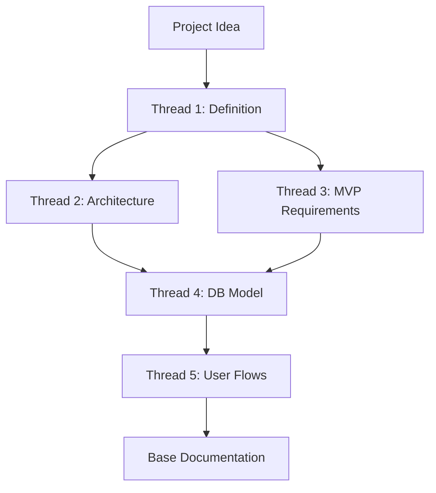

### **PHASE 0: Conceptualization and Assisted Architecture**

**Objective**: Establish a solid knowledge base for the project through structured iterations with AI.

#### **Conceptualization Process**

**Thread 1: Project Definition**

* Describe your product or application idea to the AI in detail.
* Include: problem to solve, target users, value proposition, differentiators.
* Conclude the prompt with: *"Give me a detailed step-by-step plan for the project to be successful and scalable"*.
* **Deliverable**: Initial project roadmap with milestones and recommendations.

**Thread 2: Infrastructure Architecture**

* Request an architecture diagram in Mermaid format.
* Specify: *"Based on the project context, create a technical infrastructure diagram showing components, services, databases, and communication flows"*.
* **Deliverable**: Mermaid code with complete architecture diagram.

**Thread 3: MVP Functional Requirements**

* Ask for a structured table of prioritized functional requirements.
* Suggested format: *"Generate a table of functional requirements for the MVP with columns: ID, Functionality, Description, Priority, Complexity"*.
* **Deliverable**: Exportable requirements table (Markdown/CSV).

**Thread 4: Database Modeling**

* Request the database schema design.
* Include: *"Generate the data model in Mermaid or PlantUML, including all tables, relationships, data types, and constraints"*.
* Request additionally:
  * RLS (Row Level Security) policies per table.
  * Triggers necessary for data integrity.
  * Database functions for recurring logic.
  * Recommended indexes for optimization.
* **Deliverable**: ER diagram, SQL scripts, security documentation.

**Thread 5: Business Layer and User Flows**

* Define business logic by user roles.
* Request: *"Describe step-by-step how the application will work. Explain the complete journey for each user type (role) from registration to main functions"*.
* **Deliverable**: User flow diagrams, detailed use cases.

#### **Phase 0 Outcome**

By the end of this phase, you will have:

* Clear and structured vision of the project.
* Validated technical architecture.
* Prioritized functional requirements.
* Complete database design.
* Documented business flows.
* Rich context chat for future iterations.
