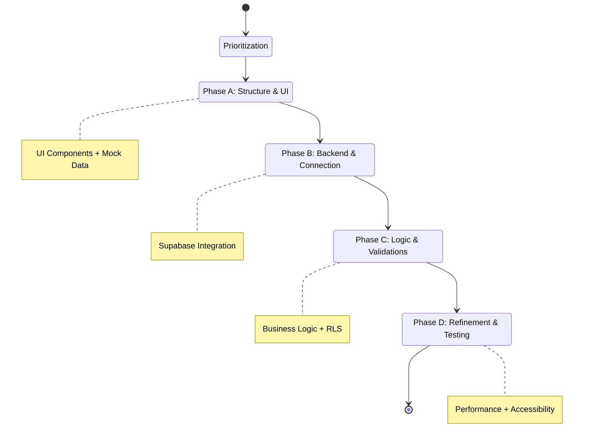

### **PHASE 5: Evolutionary Development with AI Agents**

**Objective**: Implement the project incrementally using specialized AI agents with full context.

#### **Agent Configuration in AI Editor**

**Step 1: Environment Configuration**
Open project in editor (Trae, Cursor, etc.) and verify connections.

**Step 2: Layout Agent Creation**
Configure a "Frontend Architect & UI Developer" with a System Prompt specialized in design-to-code conversion, Tailwind CSS, and component architecture.

**Step 3: Creation of AGENTS.md File**
This file provides global context in the project root.

**AGENTS.md Structure:**
1. **General Information**: Stack, Architecture, Purpose.
2. **Database Structure**: Schema, Main tables.
3. **Security Policies (RLS)**.
4. **Functions and Triggers**.
5. **User Flows**.
6. **Component Architecture**: Folders, Naming conventions.
7. **Code Patterns**: Server vs Client Components, Data Fetching.
8. **Service Configuration**.
9. **Development Rules**: TypeScript, Styles, Performance, Accessibility.
10. **Testing**.
11. **Guide for AI Agents**.
12. **Resources and Links**.

#### **Incremental Development Strategy**

**1. Flow Prioritization**
1. Authentication.
2. Onboarding.
3. Dashboard/Home.
4. Main feature.
5. Settings.

**2. Development by Phases**
* **Phase A (Structure)**: UI components with mock data. Visual validation.
* **Phase B (Backend)**: Supabase services and real connection.
* **Phase C (Logic)**: Validations, edge cases, optimistic updates.
* **Phase D (Refinement)**: Performance, accessibility, testing.

#### **Practical Example: Registration Flow**
1. **Iteration 1 (Layout)**: Create `RegisterForm` with Figma design and mock data.
2. **Iteration 2 (Services)**: Create `auth.ts` service with `signUp`, `signIn` functions.
3. **Iteration 3 (Integration)**: Connect form with service, error handling, and loading.

#### **External Services Configuration**
Use Supabase **Edge Functions** for sensitive logic, webhooks, or scheduled tasks.

#### **Development Best Practices**
* **Atomic Commits**: `feat:`, `fix:`, `style:`.
* **Branches Strategy**: `main`, `dev`, `feature/*`.
* **Code Review with AI**: Ask for security, performance, and type review before commit.
* **Continuous Documentation**: Update `AGENTS.md` and `CHANGELOG.md`.
