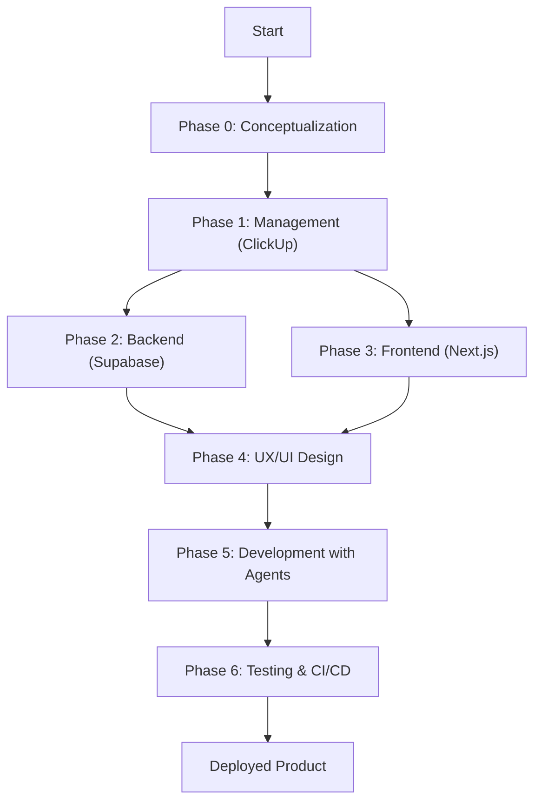

## **Introduction**

**AIDED** (AI-Driven Engineering Development) is a comprehensive software development methodology that leverages artificial intelligence capabilities in every phase of the project lifecycle. This framework provides a structured and scalable approach for building modern applications, optimizing collaboration between developers and AI.

Unlike traditional methodologies like Agile or Scrum, AIDED is specifically designed to maximize the efficiency and quality of AI-assisted development, establishing clear processes for documentation, architecture, and continuous deployment.

