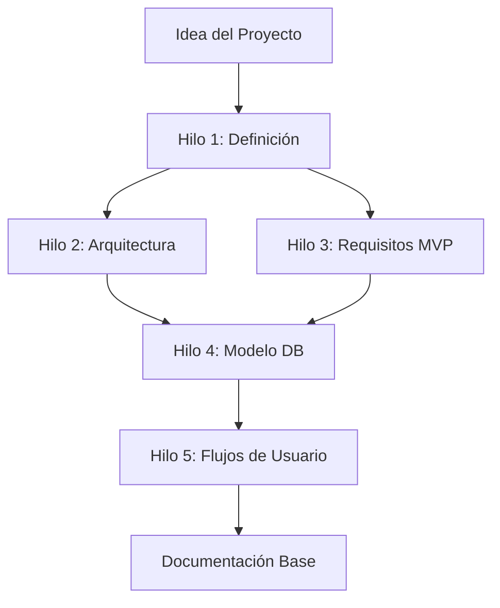

### **FASE 0: Conceptualización y Arquitectura Asistida**

**Objetivo**: Establecer una base sólida de conocimiento sobre el proyecto mediante iteraciones estructuradas con IA.

#### **Proceso de Conceptualización**

**Hilo 1: Definición del Proyecto**

* Describe tu idea de producto o aplicación a la IA de forma detallada  
* Incluye: problema a resolver, usuarios objetivo, propuesta de valor, diferenciadores  
* Concluye el prompt con: *"Dame un paso a paso detallado para que el proyecto sea exitoso y escale"*  
* **Entregable**: Roadmap inicial del proyecto con hitos y recomendaciones

**Hilo 2: Arquitectura de Infraestructura**

* Solicita un diagrama de arquitectura en formato Mermaid  
* Especifica: *"En base al contexto del proyecto, crea un diagrama de infraestructura técnica que muestre componentes, servicios, bases de datos y flujos de comunicación"*  
* **Entregable**: Código Mermaid con diagrama de arquitectura completo

**Hilo 3: Requisitos Funcionales del MVP**

* Pide una tabla estructurada de requisitos funcionales priorizados  
* Formato sugerido: *"Genera una tabla de requisitos funcionales para el MVP con columnas: ID, Funcionalidad, Descripción, Prioridad, Complejidad"*  
* **Entregable**: Tabla de requisitos exportable (Markdown/CSV)

**Hilo 4: Modelado de Base de Datos**

* Solicita el diseño del esquema de base de datos  
* Incluye: *"Genera el modelo de datos en formato Mermaid o PlantUML, incluyendo todas las tablas, relaciones, tipos de datos y constraints"*  
* Solicita adicionalmente:  
  * Políticas de RLS (Row Level Security) por tabla  
  * Triggers necesarios para integridad de datos  
  * Functions de base de datos para lógica recurrente  
  * Índices recomendados para optimización  
* **Entregable**: Diagrama ER, scripts SQL, documentación de seguridad

**Hilo 5: Capa de Negocio y Flujos de Usuario**

* Define la lógica de negocio por roles de usuario  
* Solicita: *"Describe paso a paso cómo funcionará la aplicación. Explica el recorrido completo para cada tipo de usuario (rol) desde el registro hasta las funciones principales"*  
* **Entregable**: Diagramas de flujo de usuario, casos de uso detallados

#### **Resultado de la Fase 0**

Al finalizar esta fase, dispondrás de:

* Visión clara y estructurada del proyecto  
* Arquitectura técnica validada  
* Requisitos funcionales priorizados  
* Diseño completo de base de datos  
* Flujos de negocio documentados  
* Chat con contexto rico para iteraciones futuras
