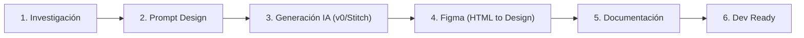

### **FASE 4: Diseño UX/UI con IA**

**Objetivo**: Crear diseños visuales profesionales y funcionales utilizando herramientas de IA y flujos optimizados.

#### **Proceso de Diseño Asistido**



**Paso 1: Investigación y Referencias**

1. **Búsqueda de Inspiración**
   - Plataformas recomendadas: Dribbble, Behance, Pinterest, Mobbin
   - Buscar por industria, tipo de app, o características específicas
   - Guardar 5-10 referencias que resuenen con tu visión
   - Analizar patrones comunes de UX en apps similares

2. **Creación de Mood Board**
   - Compilar referencias visuales
   - Identificar esquemas de color recurrentes
   - Documentar patrones de navegación efectivos
   - Anotar elementos diferenciadores

**Paso 2: Generación de Prompt de Diseño**

En tu proyecto de ChatGPT, abrir un nuevo hilo y solicitar:

```
"Genera un prompt detallado para diseñar la interfaz de [descripción de tu app]. 
El prompt debe incluir:

- Estilo visual (moderno, minimalista, corporativo, etc.)
- Paleta de colores específica
- Tipografía y jerarquía
- Componentes principales necesarios
- Comportamientos de interacción
- Responsive design considerations
- Accesibilidad (WCAG 2.1)
- Referencias a patrones de diseño específicos

Contexto del proyecto: [pegar resumen de Fase 0]"
```

**Entregable**: Prompt estructurado para generación de diseño

**Paso 3: Generación de Diseño con v0/Stitch**

**Usando v0.dev o Stitch:**

1. **Crear cuenta** en la plataforma elegida
2. **Iniciar nuevo proyecto** con el nombre de tu app
3. **Combinar elementos**:
   - Prompt generado por ChatGPT
   - Imágenes de referencia (mood board)
   - Especificaciones técnicas (tamaños de pantalla, breakpoints)

4. **Proceso iterativo**:
   ```
   Primera generación → Revisión → Ajustes al prompt → Nueva generación
   ```

5. **Generar variantes** de componentes clave:
   - Hero sections
   - Formularios
   - Dashboards
   - Cards y listados
   - Navegación
   - Estados (loading, error, success)

6. **Diseño responsive**:
   - Generar versiones mobile (320px, 375px, 428px)
   - Tablet (768px, 1024px)
   - Desktop (1440px, 1920px)

**Paso 4: Exportación y Conversión a Figma**

1. **Exportar código HTML/CSS** de las pantallas generadas

2. **Configuración en Figma**:
   - Crear nuevo proyecto en Figma
   - Instalar plugin **"HTML to Design"** (Figma)
   - Configurar artboards con dimensiones estándar

3. **Importación**:
   - Abrir plugin HTML to Design
   - Pegar código HTML/CSS exportado
   - Ajustar si es necesario el mapping de estilos
   - Generar diseño en Figma

4. **Organización en Figma**:
   ```
   📁 Proyecto
     ├── 🎨 Design System
     │   ├── Colores
     │   ├── Tipografía
     │   ├── Espaciado
     │   ├── Iconos
     │   └── Componentes Base
     ├── 📱 Mobile Screens
     ├── 💻 Desktop Screens
     ├── 🔄 User Flows
     └── 📋 Wireframes
   ```

5. **Creación de Design System**:  
   * Extraer componentes reutilizables  
   * Crear variantes de componentes  
   * Establecer auto-layout donde sea apropiado  
   * Documentar uso de cada componente  
   * Crear biblioteca de componentes compartida

**Paso 5: Documentación de Diseño**

**En ClickUp (sección UX/UI):**

* Link al proyecto de Figma  
* Guía de estilos (exportar de Figma)  
* Especificaciones de componentes  
* Flujos de usuario con screenshots  
* Decisiones de UX y justificaciones  
* Checklist de accesibilidad

**Paso 6: Preparación para Desarrollo**

1. **Activar Dev Mode en Figma** para:  
   * Inspección de CSS  
   * Exportación de assets  
   * Medidas y espaciados exactos  
2. **Exportar assets**:  
   * Iconos en formato SVG  
   * Imágenes optimizadas (WebP, AVIF)  
   * Logos en múltiples tamaños  
   * Configurar escalas de exportación (@1x, @2x, @3x)  
3. **Documentar especificaciones**:  
   * Breakpoints responsive  
   * Animaciones y transiciones  
   * Estados interactivos  
   * Comportamientos de scroll  
   * Gestos táctiles (mobile)

#### **Herramientas Alternativas**

* **v0.dev**: Excelente para componentes React/Next.js  
* **Stitch by OpenAI**: Generación completa de layouts  
* **Uizard**: Conversión de sketches a diseño  
* **Galileo AI**: Diseño desde descripción textual  
* **Figma AI**: Herramientas nativas de Figma

#### **Best Practices de Diseño**

* **Mobile-First**: Diseñar primero para mobile, luego expandir  
* **Consistencia**: Usar design system desde el inicio  
* **Accesibilidad**: Validar contraste (mínimo 4.5:1), tamaños táctiles (44x44px)  
* **Performance**: Optimizar assets, considerar lazy loading  
* **Feedback Visual**: Diseñar estados de carga, error, éxito  
* **Microinteracciones**: Añadir detalles que mejoren UX
