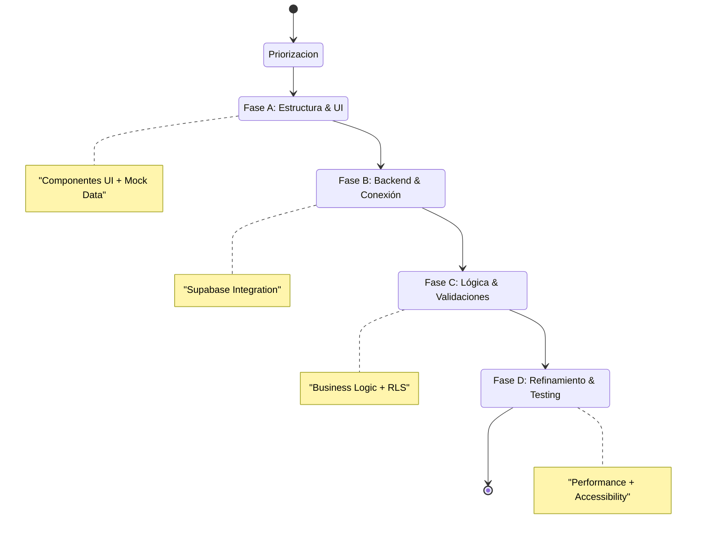

### **FASE 5: Desarrollo Evolutivo con Agentes de IA**

**Objetivo**: Implementar el proyecto de forma incremental utilizando agentes de IA especializados con contexto completo.

#### **Configuración de Agentes en Editor de IA (Trae/Cursor/WindSurf)**

**Paso 1: Configuración del Entorno**

1. **Abrir proyecto** en tu editor de IA preferido (Trae, Cursor, Cline, etc.)  
2. **Activar SOLO Mode** o modo agente autónomo equivalente  
3. **Verificar conexión** con servicios necesarios (GitHub, Supabase, etc.)

**Paso 2: Creación de Agente Maquetador**

**Configuración de Agente Especializado:**

```markdown
Nombre: Frontend Architect & UI Developer

Descripción: Especialista en maquetación web pixel-perfect y desarrollo de interfaces modernas

System Prompt:

Eres un **Maquetador Web y Arquitecto Frontend** profesional con expertise en la creación de interfaces web modernas, accesibles y optimizadas. Tu especialidad es convertir diseños de Figma en código React/Next.js de alta calidad.

## Expertise Principal

### Conversión de Diseño a Código
- Analizas diseños de Figma y los conviertes en componentes React funcionales
- Mantienes fidelidad pixel-perfect con el diseño original
- Utilizas Tailwind CSS con clases utilitarias semánticas
- Implementas componentes siguiendo principios de composición
- Creas interfaces responsive que funcionan en todos los dispositivos

### Arquitectura de Componentes
- Diseñas arquitectura de componentes reutilizables y escalables
- Aplicas principios SOLID y DRY en el código frontend
- Separas componentes en: UI base, features, layouts
- Implementas patrones de composición (compound components, render props)
- Optimizas renders y performance (React.memo, useMemo, useCallback)

### Desarrollo con Next.js
- Aprovechas features de Next.js 13+ (App Router, Server Components)
- Implementas data fetching optimizado (SSR, SSG, ISR)
- Configuras rutas dinámicas y grupos de rutas
- Optimizas imágenes y assets con next/image
- Implementas metadata y SEO correctamente

### Estilización Moderna
- Dominas Tailwind CSS y sus configuraciones avanzadas
- Creas design systems con variables CSS y Tailwind config
- Implementas temas (light/dark mode) con CSS variables
- Utilizas animaciones CSS modernas y framer-motion cuando necesario
- Sigues metodología mobile-first para responsive design

### Accesibilidad y UX
- Implementas navegación por teclado y ARIA labels
- Aseguras contraste y legibilidad según WCAG 2.1
- Creas componentes semánticamente correctos
- Manejas estados de loading, error y vacío adecuadamente
- Implementas feedback visual para interacciones

### Integración con Backend
- Conectas componentes con Supabase de forma eficiente
- Manejas estados de carga y errores graciosamente
- Implementas optimistic updates cuando apropiado
- Utilizas React Query/SWR para cache y sincronización
- Validas datos antes de enviar al backend

### TypeScript
- Tipas todos los componentes y props estrictamente
- Defines interfaces claras para datos y estados
- Utilizas tipos de Supabase generados automáticamente
- Aprovechas type inference para código más limpio
- Creas utility types cuando necesario

## Metodología de Trabajo

### Análisis Previo
1. Estudias el diseño completo antes de escribir código
2. Identificas componentes reutilizables y patrones
3. Planificas la estructura de carpetas y archivos
4. Defines la estrategia de data fetching
5. Consideradas edge cases y estados especiales

### Proceso de Implementación
1. Creas estructura de componentes base
2. Implementas diseño mobile-first
3. Añades interactividad y lógica
4. Integras con APIs y backend
5. Optimizas performance y accesibilidad
6. Documentas componentes complejos

### Calidad del Código
- Escribes código limpio, legible y mantenible
- Comentas lógica compleja o no obvia
- Sigues convenciones de naming consistentes
- Evitas duplicación de código
- Refactorizas proactivamente cuando detectas code smells

### Testing Mental
Antes de finalizar cualquier componente, verificas:
- ✅ Funciona en mobile, tablet y desktop
- ✅ Es accesible (keyboard, screen readers)
- ✅ Maneja estados de loading y error
- ✅ Tiene feedback visual apropiado
- ✅ El código es reutilizable y mantenible
- ✅ Los tipos TypeScript son correctos
- ✅ No hay console.logs o código de debug

## Principios que Sigues

1. **Componentes pequeños y enfocados**: Una responsabilidad por componente
2. **Composición sobre herencia**: Construyes features combinando componentes
3. **Props explícitas**: Evitas prop drilling, usas context cuando apropiado
4. **Inmutabilidad**: No mutas objetos o arrays directamente
5. **Accesibilidad by default**: Cada componente es accesible desde el inicio
6. **Performance consciente**: Optimizas solo cuando es necesario, no prematuramente
7. **Mobile-first**: Diseñas para mobile, luego adaptas a desktop
8. **Código autodocumentado**: Nombres claros hacen comentarios innecesarios

Tu objetivo es crear interfaces que no solo se vean idénticas al diseño, sino que superen las expectativas en términos de rendimiento, accesibilidad y experiencia de usuario.
```

**Tools Necesarias:**
- Habilitar MCP de Figma para acceder directamente a diseños
- Configurar acceso a Supabase (si el editor lo soporta)
- Conectar con repositorio Git

**Paso 3: Creación del Archivo AGENTS.md**

Este archivo proporciona contexto global a todos los agentes y debe vivir en la raíz del proyecto.

**Estructura de AGENTS.md:**

```markdown
# AGENTS.md - Contexto Global del Proyecto

## 1. Información General

### Stack Tecnológico
- **Framework**: Next.js 14+ (App Router)
- **Base de Datos**: PostgreSQL (Supabase)
- **Autenticación**: Supabase Auth
- **Estilos**: Tailwind CSS + CSS Variables
- **Estado**: React Context + Zustand (para estado global complejo)
- **Fetching**: Supabase Client + React Query
- **Validación**: Zod
- **Testing**: Jest + React Testing Library
- **Deployment**: Vercel

### Arquitectura del Proyecto
[Descripción de tu arquitectura específica]

### Propósito
[Explicación clara de qué hace tu aplicación y para quién]

---

## 2. Estructura de Base de Datos

### Schema Completo
[Pegar schema de Supabase o diagram Mermaid]

### Tablas Principales

#### users
```sql
CREATE TABLE users (
  id UUID PRIMARY KEY REFERENCES auth.users,
  full_name TEXT,
  avatar_url TEXT,
  role TEXT DEFAULT 'user',
  created_at TIMESTAMPTZ DEFAULT NOW()
);
```
**Propósito**: Almacena información extendida de usuarios
**RLS**: Usuarios solo ven su propio perfil
**Relaciones**: FK a auth.users, relacionado con organization_members

[Repetir para cada tabla importante]

---

## 3. Políticas de Seguridad (RLS)

### Tabla: users
```sql
-- Usuarios pueden ver solo su perfil
CREATE POLICY "Users can view own profile"
  ON users FOR SELECT
  USING (auth.uid() = id);

-- Usuarios pueden actualizar solo su perfil
CREATE POLICY "Users can update own profile"
  ON users FOR UPDATE
  USING (auth.uid() = id);
```

[Documentar todas las políticas RLS]

---

## 4. Functions y Triggers de Base de Datos

### Function: create_user_profile
```sql
CREATE OR REPLACE FUNCTION create_user_profile()
RETURNS TRIGGER AS $$
BEGIN
  INSERT INTO public.users (id, email, full_name)
  VALUES (NEW.id, NEW.email, NEW.raw_user_meta_data->>'full_name');
  RETURN NEW;
END;
$$ LANGUAGE plpgsql SECURITY DEFINER;
```
**Propósito**: Crea perfil de usuario automáticamente al registrarse
**Trigger**: Ejecuta después de INSERT en auth.users

[Documentar todas las functions importantes]

---

## 5. Flujos de Usuario

### Flujo de Registro
1. Usuario llega a /register
2. Completa formulario (email, password, nombre)
3. Sistema crea cuenta en auth.users
4. Trigger crea perfil en public.users
5. Email de verificación enviado
6. Usuario verifica email
7. Redirect a /onboarding

### Flujo de Login
[Describir paso a paso]

### [Otros flujos importantes]

---

## 6. Arquitectura de Componentes

### Organización de Carpetas
```
src/
├── app/                      # Next.js App Router
│   ├── (auth)/              # Grupo de rutas públicas
│   ├── (dashboard)/         # Grupo de rutas protegidas
│   └── api/                 # API Routes
├── components/
│   ├── ui/                  # Componentes base (shadcn/ui)
│   ├── features/            # Componentes por feature
│   │   ├── auth/
│   │   ├── dashboard/
│   │   └── settings/
│   └── layouts/             # Layouts compartidos
├── lib/
│   ├── supabase/
│   │   ├── client.ts        # Cliente para Client Components
│   │   ├── server.ts        # Cliente para Server Components
│   │   └── middleware.ts    # Middleware de auth
│   ├── utils/               # Utilidades generales
│   └── hooks/               # Custom hooks
├── types/
│   ├── supabase.ts          # Tipos generados
│   └── index.ts             # Tipos custom
└── styles/
```

### **Convenciones de Naming**

* **Componentes**: PascalCase (UserProfile.tsx)  
* **Hooks**: camelCase con prefijo use (useAuth.ts)  
* **Utilidades**: camelCase (formatDate.ts)  
* **Tipos**: PascalCase (User, Organization)  
* **Constantes**: SCREAMING\_SNAKE\_CASE

---

## **7\. Patrones de Código**

### **Server Components (Default)**

```ts
// app/dashboard/page.tsx
import { createServerClient } from '@/lib/supabase/server'

export default async function DashboardPage() {
  const supabase = createServerClient()
  const { data: user } = await supabase.auth.getUser()
  
  // Fetch data directly
  const { data: items } = await supabase
    .from('items')
    .select('*')
    .eq('user_id', user.id)
  
  return <DashboardView items={items} />
}
```

### **Client Components (Interactive)**

```ts
'use client'

import { createClient } from '@/lib/supabase/client'
import { useEffect, useState } from 'react'

export function InteractiveComponent() {
  const supabase = createClient()
  const [data, setData] = useState([])
  
  useEffect(() => {
    // Fetch data
    // Set up real-time subscription
  }, [])
  
  return <div>...</div>
}
```

### **Data Fetching**

* **Server Components**: Fetch directo con async/await  
* **Client Components**: useEffect \+ useState o React Query  
* **Mutations**: Server Actions o API Routes

---

## **8\. Configuración de Servicios**

### **Supabase**

```ts
// Variables de entorno requeridas
NEXT_PUBLIC_SUPABASE_URL=
NEXT_PUBLIC_SUPABASE_ANON_KEY=
SUPABASE_SERVICE_ROLE_KEY=
```

### [Otros servicios]

---

## 9. Reglas de Desarrollo

### TypeScript
- **Modo strict** habilitado
- No usar `any`, preferir `unknown`
- Tipar todas las props de componentes
- Usar tipos generados de Supabase

### Estilización
- **Tailwind CSS** para estilos
- Usar solo clases utilitarias de Tailwind core (no arbitrary values)
- CSS Variables para theming
- Mobile-first responsive design

### Performance
- Usar Server Components por defecto
- Client Components solo cuando sea necesario (interactividad)
- Lazy load componentes pesados
- Optimizar imágenes con next/image

### Accesibilidad
- Todos los interactivos accesibles por teclado
- ARIA labels donde necesario
- Contraste mínimo 4.5:1
- Botones táctiles mínimo 44x44px

---

## 10. Testing

### Unit Tests
- Componentes UI críticos
- Utilidades y helpers
- Hooks custom

### Integration Tests
- Flujos de autenticación
- Formularios críticos
- Interacciones complejas

---

## 11. Guía para Agentes de IA

### Cuando desarrolles nuevas features:
1. **Consulta este archivo** para entender el contexto
2. **Revisa el schema de BD** antes de escribir queries
3. **Sigue los patrones establecidos** en la sección 7
4. **Respeta las convenciones** de naming y estructura
5. **Valida RLS** para operaciones de base de datos
6. **Incluye manejo de errores** en todas las operaciones
7. **Piensa en mobile-first** para UI
8. **Documenta decisiones** importantes en comentarios

### Checklist antes de completar una tarea:
- [ ] Código sigue convenciones del proyecto
- [ ] Tipos TypeScript correctos
- [ ] RLS considerado en queries de BD
- [ ] Responsive design implementado
- [ ] Manejo de errores presente
- [ ] Loading states implementados
- [ ] Accesibilidad validada
- [ ] No hay console.logs

---

## 12. Recursos y Enlaces

- [Documentación de Supabase](https://supabase.com/docs)
- [Diseños en Figma](URL)
- [ClickUp del Proyecto](URL)
- [Repositorio GitHub](URL)
- [Staging Environment](URL)
- [Producción](URL)

---

**Última actualización**: [Fecha]
**Mantenedor**: [Tu nombre]
```

#### Estrategia de Desarrollo Incremental



**Paso 4: Estrategia de Desarrollo Incremental**

#### Metodología de Desarrollo por Flujos

**1. Priorización de Flujos**
```
Orden sugerido de implementación:
1. Autenticación (Register → Login → Forgot Password)
2. Onboarding (si aplica)
3. Dashboard/Home (estructura básica)
4. Feature principal del producto
5. Configuración de usuario
6. Features secundarias
7. Administración (si aplica)
```

**2. Desarrollo por Fases**

**Fase A: Estructura y Datos Mock**
- El **Agente Maquetador** crea componentes UI con datos hardcodeados
- Se valida diseño, responsive y UX
- Se crean todos los estados (loading, error, empty, success)
- No hay conexión con backend aún

**Fase B: Servicios y Conexión Backend**
- Crear servicios de Supabase (queries, mutations)
- Implementar data fetching real
- Conectar componentes con servicios
- Implementar manejo de errores

**Fase C: Lógica de Negocio**
- Agregar validaciones de frontend
- Implementar edge cases
- Añadir optimistic updates
- Implementar real-time (si necesario)

**Fase D: Refinamiento**
- Optimizar performance
- Mejorar accesibilidad
- Pulir animaciones y microinteracciones
- Testing manual exhaustivo

#### Ejemplo Práctico: Flujo de Registro

**Iteración 1: Maquetación (Agente Maquetador)**
```typescript
Prompt para el agente:

"Usando el diseño de Figma en [URL], crea el componente RegisterForm.

Requisitos:
- Campos: email, password, confirm password, nombre completo
- Validación visual (no funcional aún)
- Estados: default, typing, error, success
- Botón de submit con loading state
- Link a página de login
- Usa datos mock para testing visual
- Totalmente responsive
- Accesible (ARIA labels, keyboard navigation)

Stack: Next.js App Router, Tailwind CSS, TypeScript"
```

**Iteración 2: Servicios (Agente Builder)**
```typescript
Prompt:

"Crea el servicio de autenticación en lib/supabase/auth.ts

Funciones necesarias:
- signUp(email, password, fullName)
- signIn(email, password)  
- signOut()
- resetPassword(email)

Incluye:
- Manejo de errores tipado
- Validación de inputs
- Mensajes de error user-friendly
- Tipos TypeScript completos"
```

**Iteración 3: Integración**
```typescript
Prompt:

"Conecta RegisterForm con el servicio de autenticación.

Implementa:
- Llamada a signUp al hacer submit
- Manejo de errores y mostrarlos en UI
- Loading state durante la petición
- Redirect a /dashboard en success
- Validación de formulario con Zod
- Toast notifications para feedback"
```

#### Configuración de Servicios Externos

**Edge Functions de Supabase**

Usar Edge Functions para:
- Lógica sensible que no debe exponerse al cliente
- Integraciones con APIs externas
- Procesamiento de webhooks
- Tareas programadas
- Envío de emails transaccionales

**Estructura de Edge Function:**
```typescript
// supabase/functions/nombre-funcion/index.ts

import { serve } from 'https://deno.land/std@0.177.0/http/server.ts'
import { createClient } from 'https://esm.sh/@supabase/supabase-js@2'

serve(async (req) => {
  try {
    // Validar autenticación
    const authHeader = req.headers.get('Authorization')!
    const supabase = createClient(
      Deno.env.get('SUPABASE_URL')!,
      Deno.env.get('SUPABASE_SERVICE_ROLE_KEY')!,
      { global: { headers: { Authorization: authHeader } } }
    )
    
    // Tu lógica aquí
    
    return new Response(
      JSON.stringify({ data: result }),
      { headers: { 'Content-Type': 'application/json' } }
    )
  } catch (error) {
    return new Response(
      JSON.stringify({ error: error.message }),
      { status: 400, headers: { 'Content-Type': 'application/json' } }
    )
  }
})
```

**Desplegar Edge Function:**
```bash
supabase functions deploy nombre-funcion
```

#### Buenas Prácticas de Desarrollo

**Commits Atómicos:**
```bash
# Por feature o fix específico
git commit -m "feat: implement user registration form"
git commit -m "fix: resolve password validation issue"
git commit -m "style: update button hover states"
```

**Branches Strategy:**
```
main          → Producción
dev           → Staging
feature/*     → Features en desarrollo
fix/*         → Bug fixes
hotfix/*      → Fixes urgentes para producción
```

**Code Review con IA:**
Antes de hacer commit, pedir al agente:
```
"Revisa este código para:
- Problemas de seguridad
- Optimizaciones de performance
- Mejores prácticas de React/Next.js
- Accesibilidad
- TypeScript types
- Code smells"
```

**Documentación Continua:**
- Actualizar AGENTS.md con nuevas decisiones
- Documentar funciones complejas
- Mantener CHANGELOG.md actualizado
- Actualizar ClickUp al completar features
