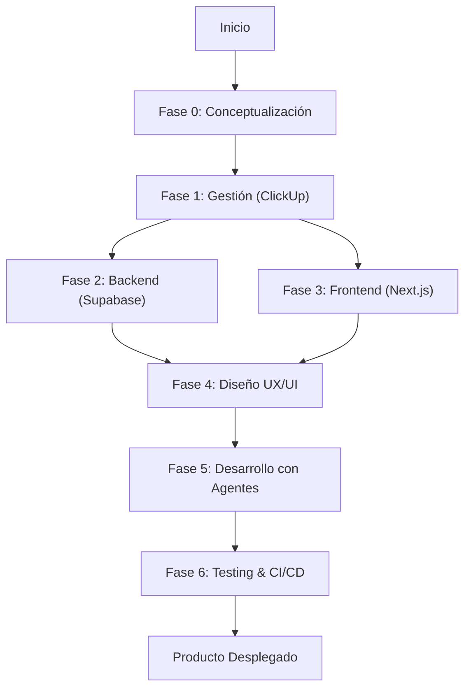

## **Introducción**

**AIDED** (AI-Driven Engineering Development) es una metodología integral de desarrollo de software que aprovecha las capacidades de la inteligencia artificial en cada fase del ciclo de vida del proyecto. Este framework proporciona un enfoque estructurado y escalable para la construcción de aplicaciones modernas, optimizando la colaboración entre desarrolladores e IA.

A diferencia de metodologías tradicionales como Agile o Scrum, AIDED está diseñado específicamente para maximizar la eficiencia y calidad del desarrollo asistido por IA, estableciendo procesos claros de documentación, arquitectura y despliegue continuos.

